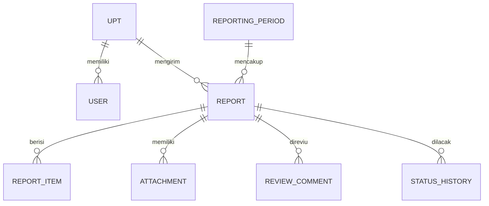

# Architecture — SIMPATIK MVP

**Versi:** 1.1  
**Horizon:** 0–2 bulan  
**Gaya arsitektur:** Monorepo dengan frontend Next.js dan backend Express.js modular monolith

---

## 1. Keputusan Utama

SIMPATIK MVP menggunakan dua aplikasi dalam satu repository:

- **Frontend:** Next.js App Router + TypeScript + Tailwind CSS + shadcn/ui.
- **Backend:** Express.js 5 + TypeScript.
- **Autentikasi:** Better Auth yang dijalankan pada backend Express.
- **ORM:** Prisma.
- **Database:** PostgreSQL.
- **File:** private object storage atau storage privat yang ditentukan saat deployment.

Express.js menangani HTTP API. Prisma dipakai di dalam backend Express untuk membaca dan mengubah PostgreSQL. Better Auth juga berjalan di Express dan menggunakan Prisma adapter.

```text
Browser
  ↓
Next.js frontend
  ↓ HTTPS / JSON / multipart
Express.js API
  ├── Better Auth
  ├── Business modules
  ├── Prisma
  └── File storage adapter
        ↓
PostgreSQL + Private File Storage
```

## 2. Alasan Pemilihan

- Memisahkan tanggung jawab UI dan API secara jelas.
- Tetap menggunakan TypeScript pada frontend dan backend.
- Express cukup ringan untuk target MVP 0–2 bulan.
- Prisma menyediakan akses database bertipe dan migrasi yang dapat ditinjau.
- PostgreSQL cocok untuk data relasional dan workflow.
- Better Auth mendukung Express, Prisma, session, dan akses berbasis role.
- shadcn/ui mempercepat pembuatan primitive UI yang konsisten dan tetap dimiliki sebagai source code aplikasi.
- Backend tetap satu aplikasi sehingga tidak membawa kompleksitas microservices.

## 3. Batas Arsitektur

### Termasuk

- Satu aplikasi Next.js.
- Satu aplikasi Express.js.
- Satu database PostgreSQL.
- Satu penyimpanan file privat.
- Satu pipeline deployment untuk setiap aplikasi.
- Modul backend dipisahkan berdasarkan domain, tetapi berjalan dalam satu proses.

### Tidak termasuk

- Microservices.
- Message broker.
- Event streaming.
- Kubernetes.
- Multi-region deployment.
- Database per module.
- Backend for Frontend tambahan di Next.js.

Next.js tidak menyimpan logika bisnis atau mengakses PostgreSQL secara langsung. Semua operasi bisnis melewati Express API.

## 4. Struktur Repository

```text
simpatik/
├── frontend/                      # Next.js
│   ├── src/
│   │   ├── app/
│   │   ├── components/
│   │   │   ├── ui/               # primitive shadcn/ui
│   │   │   └── shared/           # reusable lintas fitur
│   │   ├── features/
│   │   ├── lib/
│   │   └── styles/
│   └── public/
├── backend/                       # Express.js
│   ├── src/
│   │   ├── config/
│   │   ├── middleware/
│   │   ├── modules/
│   │   │   ├── auth/
│   │   │   ├── users/
│   │   │   ├── upt/
│   │   │   ├── periods/
│   │   │   ├── reports/
│   │   │   ├── reviews/
│   │   │   ├── dashboard/
│   │   │   ├── attachments/
│   │   │   └── audit/
│   │   ├── services/
│   │   ├── app.ts
│   │   └── server.ts
│   └── prisma/
│       ├── schema.prisma
│       └── migrations/
├── packages/
│   └── contracts/                 # DTO, enum, dan schema bersama
├── prd.md
├── architecture.md
├── tasks.md
├── agents.md
└── package.json
```

Penggunaan workspace package manager diperbolehkan, tetapi tool monorepo tambahan tidak wajib untuk MVP.

## 5. Prinsip Modular Backend

Setiap module Express memiliki batas tanggung jawab yang jelas:

```text
modules/reports/
├── report.routes.ts
├── report.controller.ts
├── report.service.ts
├── report.repository.ts
├── report.schema.ts
└── report.types.ts
```

- **Routes:** mendefinisikan method, path, dan middleware.
- **Controller:** menerjemahkan HTTP request/response.
- **Service:** menjalankan aturan bisnis dan transaksi.
- **Repository:** membungkus query Prisma.
- **Schema:** memvalidasi body, params, dan query.
- **Types:** tipe internal module.

Controller tidak boleh berisi query Prisma langsung. Repository tidak boleh menentukan keputusan role atau workflow.

## 6. Komponen Sistem

### 6.1 Frontend Next.js

Tanggung jawab:

- Halaman login.
- Navigasi sesuai role.
- Form periode, indikator, laporan, dan unggahan.
- Antrean reviu Kanwil.
- Dashboard dan tabel rekap.
- Validasi pengalaman pengguna.
- Pemanggilan Express API.

Frontend tidak dianggap sebagai batas keamanan. Semua pemeriksaan akses diulangi di backend.

#### Component architecture

Komponen frontend dibagi menjadi tiga lapisan:

1. **UI primitives** — source shadcn/ui pada `components/ui`, seperti Button, Input, Dialog, Table, Badge, Select, Sheet, Skeleton, dan Toast.
2. **Shared components** — komponen reusable lintas fitur pada `components/shared`, seperti PageHeader, DataTable, FilterBar, FormField, StatusBadge, ConfirmDialog, FileUpload, EmptyState, LoadingState, PermissionGate, dan DashboardCard.
3. **Feature components** — komponen yang mengandung konteks domain dan hanya dipakai fitur tertentu, seperti ReportForm, ReviewPanel, dan PeriodIndicatorEditor.

Aturan komponen:

- UI primitive dan shared component tidak melakukan query API bisnis secara langsung.
- Shared component menerima data, callback, state, dan permission melalui props.
- Komponen baru diekstrak menjadi shared component setelah digunakan ulang atau memiliki pola UI stabil.
- Hindari satu komponen DataTable raksasa; ekstrak perilaku yang benar-benar berulang dan biarkan konfigurasi kolom tetap milik fitur.
- Form memakai primitive shadcn/ui dengan schema validation yang sama secara konsep dengan kontrak backend.
- Setiap reusable component menangani state loading, empty, error, disabled, dan akses bila relevan.
- Accessibility, keyboard navigation, label, focus state, dan error message menjadi bagian kriteria penerimaan komponen.

### 6.2 Backend Express.js

Tanggung jawab:

- Better Auth handler.
- Session dan identitas pengguna.
- Role dan pembatasan UPT.
- Validasi request.
- Workflow laporan.
- Query dan transaksi Prisma.
- Upload/download dokumen.
- Dashboard aggregation.
- Audit log.
- Error handling dan observability.

### 6.3 Prisma

Prisma berada di backend dan digunakan untuk:

- Model data relasional.
- Query bertipe.
- Constraint dan indeks.
- Transaksi perubahan status.
- Migrasi database.
- Seed data UPT dan akun awal.

Prisma bukan database dan bukan pengganti Express. Alurnya:

```text
Express service → Prisma Client → PostgreSQL
```

### 6.4 PostgreSQL

PostgreSQL menjadi sumber data resmi untuk:

- Pengguna dan session.
- UPT.
- Periode dan indikator.
- Laporan serta item laporan.
- Metadata dokumen.
- Catatan reviu.
- Histori status.
- Audit log.

### 6.5 File storage

File tidak disimpan sebagai byte besar di PostgreSQL. Database hanya menyimpan metadata dan storage key.

Aturan minimum:

- Bucket/direktori bersifat privat.
- Nama storage dibuat acak.
- Nama asli hanya disimpan sebagai metadata.
- Download diberikan melalui backend setelah pemeriksaan akses.
- Ukuran dan tipe file dibatasi.
- File yang sudah menjadi bukti laporan resmi tidak dapat dihapus melalui alur biasa.

## 7. Autentikasi dan Otorisasi

### 7.1 Better Auth

Better Auth dijalankan pada Express API.

```text
POST /api/auth/sign-in/email
GET  /api/auth/get-session
POST /api/auth/sign-out
```

Konfigurasi penting:

- Gunakan ESM pada backend Express.
- Mount handler Better Auth sebelum `express.json()`.
- Untuk Express 5, gunakan catch-all route yang sesuai dokumentasi Better Auth.
- Session menggunakan secure cookie.
- Origin Next.js dimasukkan ke `trustedOrigins`.
- Frontend mengirim request dengan credentials.
- Produksi menggunakan HTTPS.

### 7.2 Role

```ts
type Role =
  | "PIMPINAN"
  | "PRODUCT_OWNER"
  | "PETUGAS_KANWIL"
  | "KOORDINATOR_UPT"
  | "PETUGAS_UPT"
  | "ADMIN_SIMPATIK"
  | "SYSTEM_ADMIN";
```

Role dapat disimpan sebagai field tambahan pada user. `uptId` wajib tersedia untuk Koordinator UPT dan Petugas UPT.

### 7.3 Authorization middleware

Urutan middleware bisnis:

```text
request
  → requireSession
  → requireRole(...)
  → enforceUptScope
  → validateRequest
  → controller
```

Aturan penting:

- ID UPT dari client tidak pernah dipercaya tanpa dibandingkan dengan session.
- Admin SIMPATIK mengakses administrasi akun, UPT, dan periode tanpa otomatis menjadi approver bisnis.
- Petugas Kanwil mengakses seluruh UPT untuk reviu; Product Owner memberikan persetujuan akhir.
- Koordinator UPT dan Petugas UPT dibatasi ke UPT sendiri.
- Pimpinan hanya menggunakan endpoint baca.
- System Administrator mengakses fungsi teknis tanpa hak substansi laporan secara default.
- Pemeriksaan akses dilakukan kembali ketika mengunduh file.

## 8. Model Data Konseptual

### 8.1 Entitas

| Entitas | Field utama |
|---|---|
| User | id, name, email, role, uptId, active |
| Session | field session Better Auth |
| UPT | id, code, name, active |
| ReportingPeriod | id, name, startDate, dueDate, status |
| Indicator | id, periodId, code, name, required, order |
| Report | id, uptId, periodId, status, version, createdById, submittedAt, reviewedAt, approvedAt |
| ReportItem | id, reportId, indicatorId, value, narrative |
| Attachment | id, reportId, reportItemId, storageKey, originalName, mimeType, size, uploadedById |
| ReviewComment | id, reportId, message, createdById, createdAt |
| StatusHistory | id, reportId, fromStatus, toStatus, actorId, note, createdAt |
| AuditLog | id, actorId, action, entityType, entityId, metadata, createdAt |

### 8.2 Relasi utama



### 8.3 Constraint minimum

- Unique `Report(uptId, periodId, reportType)`.
- Index `Report(periodId, status)`.
- Index `Report(uptId, periodId)`.
- Index `StatusHistory(reportId, createdAt)`.
- Index `AuditLog(actorId, createdAt)`.
- Foreign key memakai kebijakan delete yang mencegah hilangnya histori resmi.

## 9. Workflow dan Transaksi

Status:

```text
DRAFT → SUBMITTED → REVIEWED → APPROVED
             ↓
      REVISION_REQUIRED → SUBMITTED
```

Setiap transisi:

1. Memeriksa session, role, dan UPT.
2. Memeriksa status asal.
3. Memvalidasi kelengkapan.
4. Mengubah status Report.
5. Menulis StatusHistory.
6. Menulis AuditLog.
7. Menjalankan seluruh perubahan dalam satu transaksi Prisma.

## 10. API MVP

### Auth

- `ALL /api/auth/*splat` — handler Better Auth pada Express 5.

### Users dan UPT

- `GET /api/users`
- `POST /api/users`
- `PATCH /api/users/:id`
- `GET /api/upts`
- `POST /api/upts`
- `PATCH /api/upts/:id`

### Periode dan indikator

- `GET /api/periods`
- `POST /api/periods`
- `GET /api/periods/:id`
- `PATCH /api/periods/:id`
- `POST /api/periods/:id/indicators`
- `PATCH /api/indicators/:id`

### Laporan

- `GET /api/reports`
- `POST /api/reports`
- `GET /api/reports/:id`
- `PATCH /api/reports/:id`
- `POST /api/reports/:id/submit`
- `POST /api/reports/:id/request-revision`
- `POST /api/reports/:id/mark-reviewed`
- `POST /api/reports/:id/approve`
- `GET /api/reports/:id/history`

### Dokumen

- `POST /api/reports/:id/attachments`
- `GET /api/attachments/:id/download`
- `DELETE /api/attachments/:id` — hanya sebelum laporan diajukan.

### Dashboard dan rekap

- `GET /api/dashboard/summary`
- `GET /api/dashboard/by-upt`
- `GET /api/exports/reports.csv`

### Sistem

- `GET /health/live`
- `GET /health/ready`

## 11. Format API

Respons sukses:

```json
{
  "data": {},
  "meta": {}
}
```

Respons gagal:

```json
{
  "error": {
    "code": "REPORT_INVALID_STATUS",
    "message": "Laporan tidak dapat diajukan dari status saat ini.",
    "fields": []
  }
}
```

API menggunakan:

- JSON untuk data biasa.
- Multipart hanya untuk unggahan.
- Pagination untuk daftar.
- ISO 8601 untuk pertukaran waktu.
- Zona Asia/Jakarta untuk tampilan pengguna.

## 12. Keamanan

- HTTPS wajib pada produksi.
- CORS allowlist, bukan wildcard.
- Better Auth `trustedOrigins` dikonfigurasi eksplisit.
- Cookie `HttpOnly`, `Secure`, dan kebijakan `SameSite` yang sesuai topologi domain.
- Rate limit pada login, reset password, upload, dan ekspor.
- Security headers pada Next.js dan Express.
- Validasi seluruh body, params, query, dan file.
- ORM tidak menggantikan authorization; setiap query tetap dibatasi role/UPT.
- Secret disimpan sebagai environment variable.
- Log tidak memuat password, cookie, token, atau isi dokumen.
- Error handler produksi menghapus stack trace dari respons.

Untuk mengurangi masalah cookie dan CORS, deployment produksi disarankan memakai satu origin:

```text
https://simpatik.example.go.id       → Next.js
https://simpatik.example.go.id/api   → reverse proxy ke Express
```

## 13. Observability dan Operasional

- Structured application log.
- Request/correlation ID.
- Health check untuk aplikasi dan database.
- Pencatatan error tanpa data sensitif.
- Monitoring waktu respons dan error rate.
- Backup PostgreSQL terjadwal.
- Backup atau versioning file storage.
- Prosedur restore diuji sebelum pilot.

## 14. Testing

### Frontend

- Unit test untuk helper, primitive yang dikustomisasi, dan reusable component kritis.
- Integration test untuk form, DataTable, filter, permission state, dan upload.
- Visual QA untuk loading, empty, error, disabled, responsive, dan focus state.
- E2E untuk alur tujuh role.

### Backend

- Unit test service dan aturan transisi.
- Integration test API dengan database test.
- Authorization test lintas role dan UPT.
- Upload validation test.
- Contract test respons API.

### Skenario kritis

- UPT A tidak dapat mengakses laporan UPT B.
- Laporan tidak lengkap tidak dapat diajukan.
- Petugas UPT tidak dapat mengajukan tanpa Koordinator UPT.
- SUBMITTED tidak dapat diedit.
- Permintaan revisi memerlukan catatan.
- Petugas Kanwil tidak dapat memberikan persetujuan akhir.
- Product Owner hanya dapat menyetujui laporan REVIEWED.
- APPROVED tidak dapat diubah.
- Dashboard sesuai laporan sumber.

## 15. Deployment

Komponen:

```text
Reverse proxy
├── Next.js process/container
└── Express.js process/container
      ├── PostgreSQL
      └── Private file storage
```

Pipeline minimum:

1. Install dependency dengan lockfile.
2. Lint dan type-check.
3. Jalankan unit/integration test.
4. Build frontend dan backend.
5. Jalankan Prisma migration terkontrol.
6. Deploy.
7. Jalankan smoke test.

## 16. Environment

Minimum:

```text
NODE_ENV
WEB_URL
API_URL
DATABASE_URL
BETTER_AUTH_URL
BETTER_AUTH_SECRET
TRUSTED_ORIGINS
STORAGE_DRIVER
STORAGE_BUCKET
MAX_UPLOAD_SIZE
```

Nilai rahasia tidak boleh menggunakan contoh default pada produksi.

## 17. Architecture Decision Records

### ADR-001 — Frontend dan backend dipisahkan

**Keputusan:** Next.js hanya menangani frontend; seluruh logika bisnis berada di Express API.  
**Konsekuensi:** Kontrak API, cookie, CORS, dan deployment dua aplikasi harus dikelola.

### ADR-002 — Express modular monolith

**Keputusan:** Satu aplikasi Express dengan module domain.  
**Konsekuensi:** Lebih mudah dioperasikan daripada microservices, tetapi batas antar-module harus dijaga melalui struktur kode.

### ADR-003 — Prisma dan PostgreSQL

**Keputusan:** Prisma Client dan Prisma Migrate digunakan untuk PostgreSQL.  
**Konsekuensi:** Migrasi menjadi bagian dari release dan query khusus tetap dapat menggunakan SQL terkontrol bila diperlukan.

### ADR-004 — Better Auth pada Express

**Keputusan:** Better Auth menjadi pemilik autentikasi dan session; authorization bisnis tetap dibuat di middleware/service SIMPATIK.  
**Konsekuensi:** Handler Better Auth harus dipasang dengan urutan middleware yang benar dan origin harus dikonfigurasi eksplisit.

## 18. Referensi Teknis

- [Express integration — Better Auth](https://better-auth.com/docs/integrations/express)
- [Security — Better Auth](https://www.better-auth.com/docs/reference/security)
- [Express.js 5 routing](https://expressjs.com/en/5x/guide/routing/)
- [Next.js data security](https://nextjs.org/docs/app/guides/data-security)
- [Prisma PostgreSQL connector](https://www.prisma.io/docs/orm/core-concepts/supported-databases/postgresql)
- [Prisma Migrate](https://www.prisma.io/docs/orm/prisma-migrate)
- [shadcn/ui untuk Next.js](https://ui.shadcn.com/docs/installation/next)
- [shadcn/ui Data Table](https://ui.shadcn.com/docs/components/base/data-table)
- [shadcn/ui forms](https://ui.shadcn.com/docs/forms)
